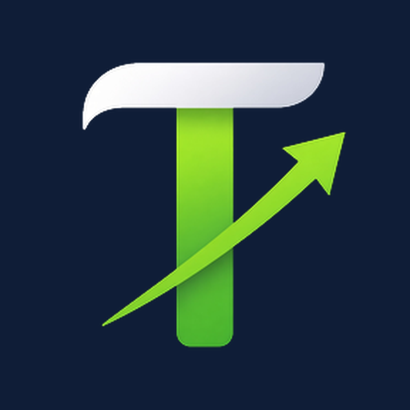
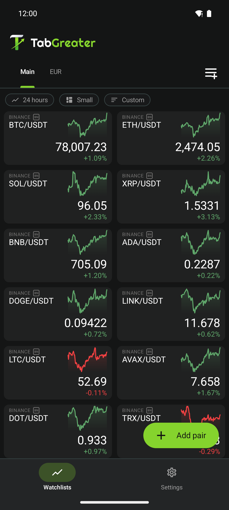
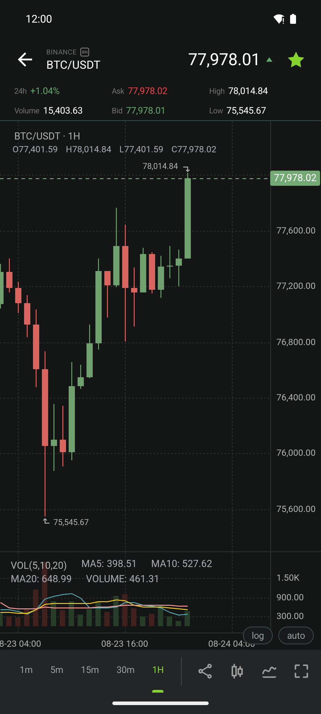
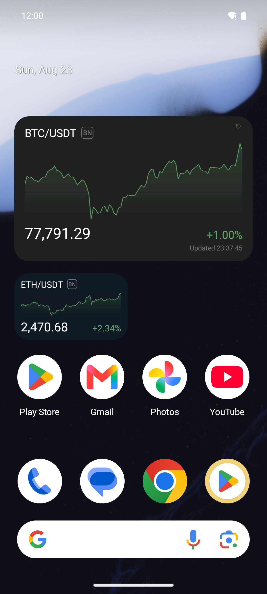
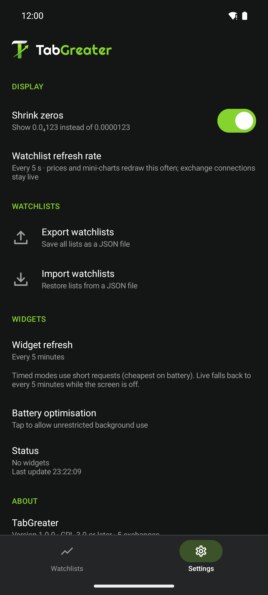

<h1 align="center">TabGreater</h1>

<p align="center">
  
</p>

<h3 align="center">Crypto watchlist with live prices, charts and home-screen widgets. No account, no ads, no tracking.</h3>

<p align="center">
  <a href="https://github.com/NeatCode-Labs/TabGreater/releases/latest"></a>
  <a href="https://developer.android.com/about/versions/oreo"></a>
  <a href="LICENSE"></a>
  <a href="docs/PRIVACY.md"></a>
</p>

<p align="center">
  <a href="https://github.com/NeatCode-Labs/TabGreater/releases/latest"></a>
</p>

<p align="center">
  <a href="https://tabgreater.com">Website</a> ·
  <a href="docs/BUILDING.md">Building</a> ·
  <a href="docs/PRIVACY.md">Privacy</a> ·
  <a href="CONTRIBUTING.md">Contributing</a> ·
  <a href="SECURITY.md">Security</a>
</p>

TabGreater is a free, open-source Android watchlist for spot crypto markets.
It shows live prices from five exchanges on sparkline tiles, opens a full
candlestick chart with indicators for any pair, and keeps one-pair widgets on
your home screen fresh — without a notification. Your phone talks to the
exchanges directly: there is no backend, no account and nothing is collected.

## Highlights

- **Watchlists** — several named lists, four tile sizes: two per row (Small,
  Compact) or full width (Medium, Large). Sparkline period 1 h / 24 h / 7 d /
  30 d, five sort orders (Custom, Exchange + Pair, Pair + Exchange, Price,
  Change); drag to reorder, long-press for colour stripes, move and delete;
  JSON export and import.
- **Live prices** — WebSocket streams while the app is open on Binance,
  Gate.io, Kraken and KuCoin; MEXC has no public ticker socket, so it is polled
  over REST. A candle cache on disk keeps tiles from ever being empty.
- **Charts** — candles / hollow / OHLC / area, timeframes 1 m … 1 M, eleven
  indicators (MA, EMA, BOLL, SAR, VOL, MACD, RSI, KDJ, CCI, DMI, OBV),
  log / auto scale, fullscreen, share as PNG. You can pan back through history
  on most exchanges; Kraken's public API returns only its newest ~720 bars.
- **Widgets** — one pair per widget. Drops as 2 × 1 and resizes freely from
  110 × 40 dp up to 4 × 2 and beyond, always drawing the same layout. The
  sparkline is a switch, on by default, and always shows the last 24 h. Refresh
  cadence of your choice, from every 15 minutes to live, with no notification;
  three widgets at the default 5-minute cadence cost about 1.5 % battery a day.
- **Quick add** — the five biggest coins that are not stablecoins or wrapped
  tokens are one tap away when you add a pair (ranking from CoinGecko,
  refreshed daily).
- **Exchanges** — Binance, Gate.io, Kraken, KuCoin, MEXC (spot only).
- **Dark theme**, en-US number formatting, "shrink zeros" for sub-cent prices
  (`0.0₄123`).

## Screenshots

<table>
  <tr>
    <td align="center"><br><sub><b>Watchlist</b></sub></td>
    <td align="center"><br><sub><b>Chart</b></sub></td>
    <td align="center"><br><sub><b>Widgets</b></sub></td>
    <td align="center"><br><sub><b>Settings</b></sub></td>
  </tr>
</table>

## Installation

Download the latest signed APK from **[tabgreater.com/download](https://tabgreater.com/download)** or
straight from **[GitHub Releases](https://github.com/NeatCode-Labs/TabGreater/releases/latest)**. Every
release lists the SHA-256 of the APK and of the signing certificate, so you can check what you
downloaded.

An F-Droid submission is in review; this section will link it once it is live.

Android 8.0 (API 26) or newer. APK installs may require temporarily allowing
your browser or file manager to install unknown apps.

Widgets refresh through a foreground service that shows **no** notification.
On phones with aggressive battery management (One UI, MIUI, …) set the app to
*Unrestricted* battery use — **Settings → WIDGETS → Battery optimisation** in
the app walks you through it.

## Privacy and safety

- **Nothing collected** — no account, no analytics, no crash reporting, no ads,
  no server.
- **Direct connections** — prices come straight from each exchange's public
  API, so your IP address and the pairs you watch are visible to the exchanges
  you use, under their terms. All connections are HTTPS / WSS.
- **Local data** — watchlists, settings and the candle cache stay on the
  device (and in your Android backup, if enabled). Exports go only where you
  point the system file picker.
- **No keys, no trades** — the app never asks for exchange API keys and
  cannot place orders.

Read the complete **[Privacy policy](docs/PRIVACY.md)**.

## Disclaimer

Prices are indicative and may be delayed, incomplete or wrong. TabGreater is
**not financial advice** and executes no trades. Use it at your own risk.

## Support

TabGreater is free and will stay free. If it is useful to you:

- Star the repository
- Report bugs through
  **[GitHub Issues](https://github.com/NeatCode-Labs/TabGreater/issues)**
- Share the app with people who want a watchlist that does not watch them
- Optionally **[buy us a coffee](https://ko-fi.com/neatcodelabs)** or send
  Monero (the address is in **Settings → ABOUT → Support the project**)

Donations keep the project going; they do not unlock anything in the app.

## Frequently asked questions

<details>
<summary><b>Why is Coinbase not supported?</b></summary>

Coinbase's market-data terms do not allow third-party apps to show their data
to end users, so it is left out on purpose.

</details>

<details>
<summary><b>Is this TabTrader?</b></summary>

No. TabGreater is an independent open-source project by NeatCode Labs. It is
not affiliated with, endorsed by or connected to TabTrader or Trader
Acquisition Corp.

</details>

<details>
<summary><b>Why does the widget need a foreground service and exact alarms?</b></summary>

Android only lets an app refresh a widget on a reliable schedule from a
foreground service, and only exact alarms survive Doze at the cadence you pick.
The service shows no notification, and the app never asks for notification
permission. The Google Play build drops the exact-alarm and
battery-optimisation permissions to comply with Play policy.

</details>

<details>
<summary><b>Where does the "popular pairs" list come from?</b></summary>

From CoinGecko's public market-cap ranking, fetched at most once a day and
cached on the device; stablecoins and wrapped tokens are filtered out. If the
request fails, the app falls back to the last cached list.

</details>

## Building

JDK 21 and the Android SDK (platform 36) are enough — no Android Studio
required. Two product flavours exist: `foss` (GitHub Releases and F-Droid; the
default) and `play` (Google Play). See **[docs/BUILDING.md](docs/BUILDING.md)**.

```bash
./gradlew assembleFossDebug
```

## Licence

TabGreater is licensed under the **GNU General Public License v3.0 or later** —
see [LICENSE](LICENSE) and [NOTICE](NOTICE). Third-party components and their
licences are listed in [NOTICE](NOTICE) and in the app under
**Settings → ABOUT**: [KLineChart](https://github.com/klinecharts/KLineChart)
(Apache-2.0) powers the chart, the brand font is
[Righteous](https://fonts.google.com/specimen/Righteous) (SIL OFL 1.1), and
the popular-pairs list is powered by [CoinGecko](https://www.coingecko.com).

Exchange names are trademarks of their respective owners. TabGreater is not
affiliated with, endorsed by or sponsored by any exchange or data provider.

---

<p align="center">
  Created by <strong><a href="https://neatcodelabs.com">NeatCode Labs</a></strong><br>
  <em>Watching the markets, never the user.</em>
</p>

<p align="center">
  <a href="https://neatcodelabs.com"></a>
  <a href="https://ko-fi.com/neatcodelabs"></a>
</p>
